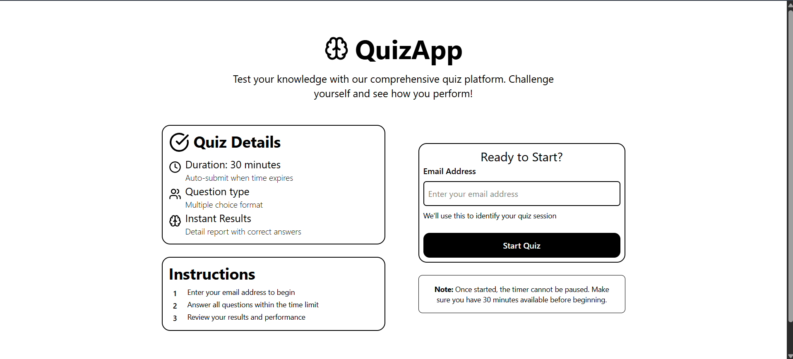
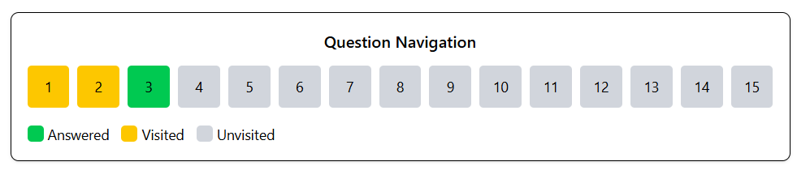

# Quiz App

A responsive and interactive quiz application built with **React** that allows users to attempt quizzes, track progress, and submit results. It supports timed quizzes, answer tracking, and live question navigation.


## 🚀 Features

- **Dynamic Questions**: Fetches questions from API dynamically.
- **Timer Functionality**: 30-minute countdown for each quiz session.
- **Answer Tracking**: Stores user answers and visited questions.
- **Question Navigation**: Navigate between questions without losing progress.
- **Submission Flow**: Auto-submits when time runs out or user clicks submit.
- **Responsive UI**: Works seamlessly on desktop and mobile.


## 🛠️ Tech Stack

- **Frontend**: React (Vite)
- **Styling**: Tailwind CSS
- **Routing**: React Router
- **API**: Fetching questions from Open Trivia DB (or custom API)


## ⚡ Installation & Setup

1. **Clone the Repository**
   ```bash
   git clone https://github.com/your-username/quiz-app.git
   cd quiz-app

2. **Install Dependencies**
    ```bash
    npm install

3. **Start Development Server**
    ```bash
    npm run dev

## Usage
- Start the quiz by providing your email (required).

- Answer questions using multiple-choice options.

- Navigate between questions using the navigation buttons.

- Submit manually or wait for auto-submit when the timer ends.

- View results and feedback.

## Screenshorts





